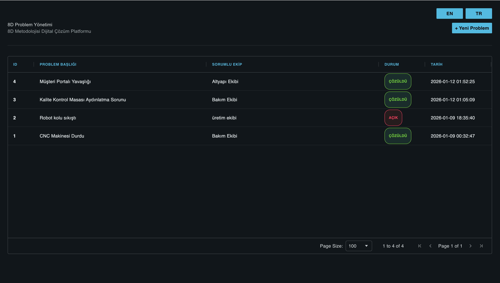
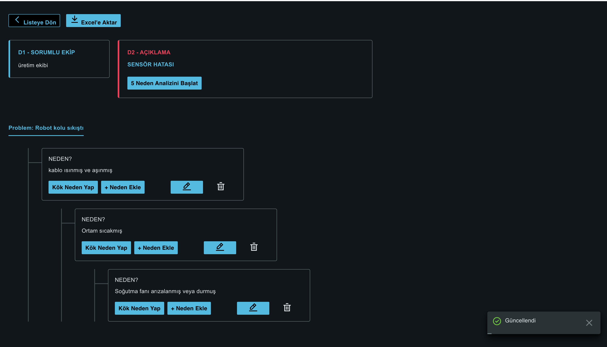
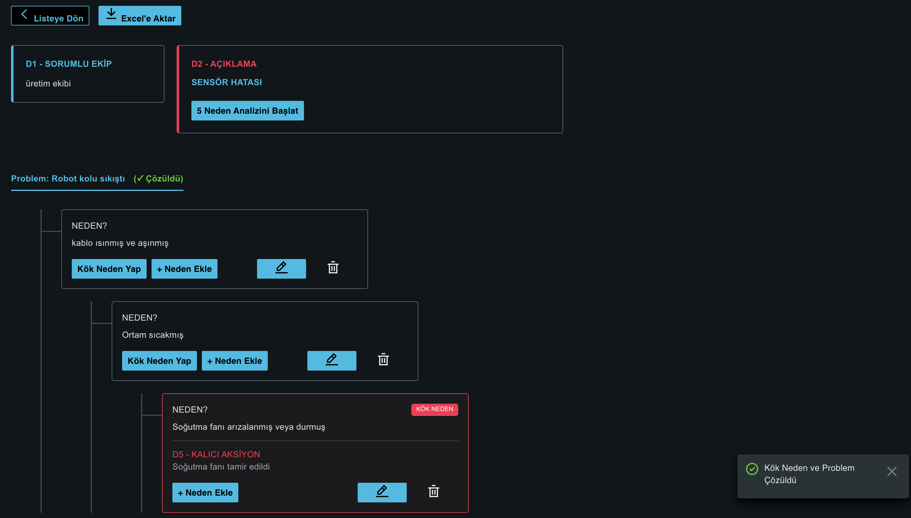

## Uygulama Görselleri

| Dashboard (D1-D2) | Kök Neden Analizi (D4) | Kök Neden & Aksiyon (D5) |
|:---:|:---:|:---:|
|  |  |  |

> **Not:** Kullanıcı bir nedeni "Kök Neden" olarak işaretlediğinde, D5 aksiyon alanı aktifleşir ve problem durumu otomatik olarak güncellenir.

## 8D Problem Yönetimi ve Kök Neden Analizi Platformu (MVP)
Bu platform, operasyonel süreçlerde karşılaşılan problemleri dijital ortamda merkezi olarak takip etmek ve 8D Metodolojisi çerçevesinde profesyonel kök neden analizleri (Root Cause Analysis) gerçekleştirmek amacıyla geliştirilmiştir. Proje, Siemens Case Study gereksinimlerine tam uyumlu olarak Siemens iX Design System standartlarında, esnek ve ölçeklenebilir bir yapıda kurgulanmıştır.

## Dil Desteği (Language Support)
Uygulama, kurumsal ihtiyaçlara uygun olarak tam kapsamlı Türkçe ve İngilizce çift dil desteğine sahiptir. Dashboard üzerinden anlık geçiş yapılabilir.

## Teknoloji Yığını (Tech Stack)
Frontend: React.js, Siemens iX Design System.

Veri Tablosu: Ag-Grid (D1-D2 problemlerinin endüstriyel standartlarda listelenmesi).

Backend: Native PHP (RESTful JSON API mimarisi).

Veritabanı: MySQL (Gerçek zamanlı hiyerarşik ağaç yapısı için ilişkisel model).

Dışa Aktarım: XLSX kütüphanesi ile analiz ağacının hiyerarşik Excel raporlaması.

## Öne Çıkan Özellikler
D1-D2 (Problem Tanımlama): Dashboard üzerinden sorumlu ekip ataması, detaylı problem tanımı ve gerçek zamanlı durum takibi.

D4 (Dinamik 5 Neden Analizi): Her problem altında sınırsız derinlikte alt neden (Child Node) ekleyebilme ve görselleştirme.

D5 (Kalıcı Aksiyon Planı): Analizdeki herhangi bir dalın "Kök Neden" olarak işaretlenmesi, çözüm planının girilmesi ve resolved_at zaman damgasının otomatik atanması.

Otomatik Durum Senkronizasyonu: Bir kök neden belirlenip aksiyon girildiğinde, problem durumu veritabanında otomatik olarak "ÇÖZÜLDÜ" (Resolved) olur.

Siemens iX Standartları: Tamamen Siemens kurumsal renkleri (Petroleum & Alarm), iX bileşenleri (Modal, Spinner, Card, Typography) ve UX kuralları uygulanmıştır.

## Kurulum ve Çalıştırma
1. Veritabanı Kurulumu
backend/schema.sql dosyasını MySQL veritabanınızda içeri aktarın (Import).

backend/config/db.php dosyasındaki bağlantı bilgilerini kendi yerel ayarlarınıza göre güncelleyin.

2. Backend (API) Sunucusu
backend klasörünü yerel PHP sunucunuzun (XAMPP htdocs, MAMP vb.) kök dizinine kopyalayın.

3. Frontend (React) Çalıştırma

# Frontend dizinine gidin
cd frontend

# Bağımlılıkları yükleyin
npm install

# Uygulamayı geliştirme modunda başlatın
npm run dev